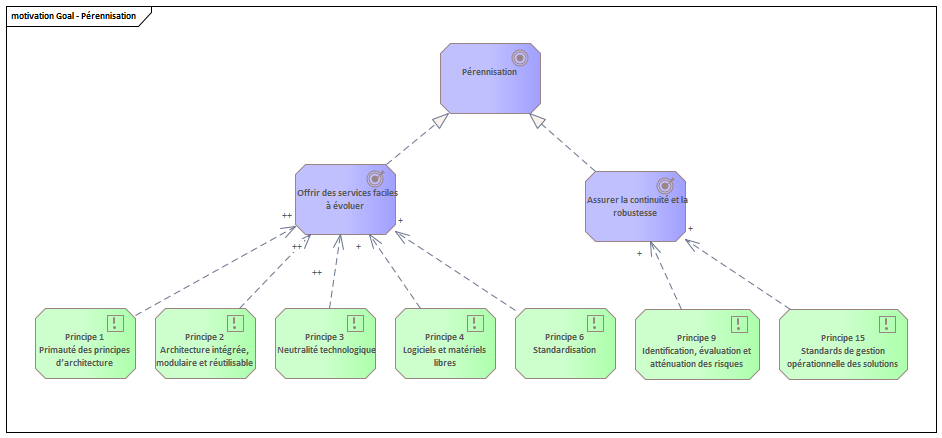

# Vue de motivation
[Motivation](Readme.md)  
[Parties prenante et pilotes](Stakeholders.md)  
[Évaluations](Assessments.md)  
[Objectifs](Goals.md)  
[Principes directeurs de l'architecture](Principes.md)  
[Exigences](Requirements.md)    
# Buts/Objectifs
À partir des évaluations des parties prenantes du programme MeC, la liste des objectifs suivants a été identifiée :

  

[Services numériques](#digital-services)  
[Services accessibles](#accessible-services)  
[Données ouvertes](#open-data)  
[Réplicabilité](#replicability)  
[Pérennisation](#sustainability)  
[Approche expérimentale](#experimentation)  
[Mutualisation](#pooling)  
[Écoconception](#eco-design)  

<a id='digital-services' class='anchor' aria-hidden='true'/>  

# Services numériques  
Étant donnée la dépendance de la technologie dans la vie des citoyen, le défi cherche à fournir une plateforme numérique permettant l’accès aux services rendus.  
Le *résultat* recherché est d’*établir une architecture de solution intégrée, adaptable et évolutive*. Tous les principes directeurs du programme dérivent de cet *objectif* et visent à obtenir ce *résultat*.

  
<a id='accessible-services' class='anchor' aria-hidden='true'/>  

# Services accessibles  
Deux *résultats* :  
-	Faciliter l’utilisation
    - Principe 7: Identité numérique commune
    - Principe 10: Accessibilité et convivialité
-	Diminuer la fracture technologique
    - Principe 13: Inclusion numérique

<a id='open-data' class='anchor' aria-hidden='true'/>  

# Données ouvertes  
3 *résultats* recherchés:  
- Assurer l'accès aux données pour offrir des services de qualité
- Respecter la charte des données numériques de la ville
- Respecter la loi sur la protection des renseignements personnels

<a id='replicability' class='anchor' aria-hidden='true'/>  

# Réplicabilité 
2 *résultats* recherchés:
-	Diminuer le menottage technologique
    -	Principe 3: Neutralité technologique
-	Favoriser le partage d'expériences
    -	Principe 4: Logiciels et matériels libres

<a id='sustainability' class='anchor' aria-hidden='true'/>  

# Périnisation 
2 *résultats* recherchés:
- Offrir des services faciles à évoluer
- Assurer la continuité et la robustesse

<a id='experimentation' class='anchor' aria-hidden='true'/>  

# Approche expérimentale 
*Résultat*:
- Offrir des services faciles à évoluer
    - Principe 1: Primauté des principes d’architecture
    - Principe 2: Architecture intégrée, modulaire et réutilisable
    - Principe 3: Neutralité technologique
    - Principe 4: Logiciels et matériels libres
    - Principe 6: Standardisation

<a id='pooling' class='anchor' aria-hidden='true'/>  

# Mutualisation 
La mutualisation permet de mettre en partage des ressources et outils pour maximiser leur utilisation et aussi élargir la base d’utilisateurs qui en bénéficient.  

<a id='eco-design' class='anchor' aria-hidden='true'/>  

# Écoconception 
*Résultat*:
- Réduire l'empreinte écologique
    - Principe 14:  
    Écoconception des services et produits
        - Exigence E 14.1:  
        Les services et produits sont offerts selon une vision stratégique d'écoconception
        - Exigence E 14.2:  
        Les guides opérationnelles favorisent le choix des solutions et produits conformes au principe d'écoconception
        - Exigence E 14.3:  
        Les services offerts respectent une transition écologique

