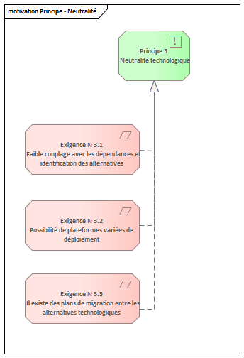

# Vue de motivation
[Motivation](Readme.md)  
[Parties prenante et pilotes](Stakeholders.md)  
[Évaluations](Assessments.md)  
[Objectifs](Goals.md)  
[Principes directeurs de l'architecture](Principes.md)  
[Exigences](Requirements.md)    

# Exigences
Un principe est réalisé par des exigences qui ont pour but de présenter une liste de contrôle qu’un composant doit vérifier pour se conformer avec ce principe.  
Le principe de *Neutralité technologique* par exemple est réalisé en observant les trois exigences suivants :
- Exigence N 3.1  
Faible couplage avec les dépendances et identification des alternatives
- Exigence N 3.2  
Possibilité de plateformes variées de déploiement
- Exigence N 3.3  
Il existe des plans de migration entre les alternatives technologiques

  

Le programme MeC exige que les contributions soient soumises à une analyse de conformité lors des changements majeurs et de façon périodique. Cette analyse est tout simplement une feuille de contrôle qui contient la liste des principes avec leurs exigences.
